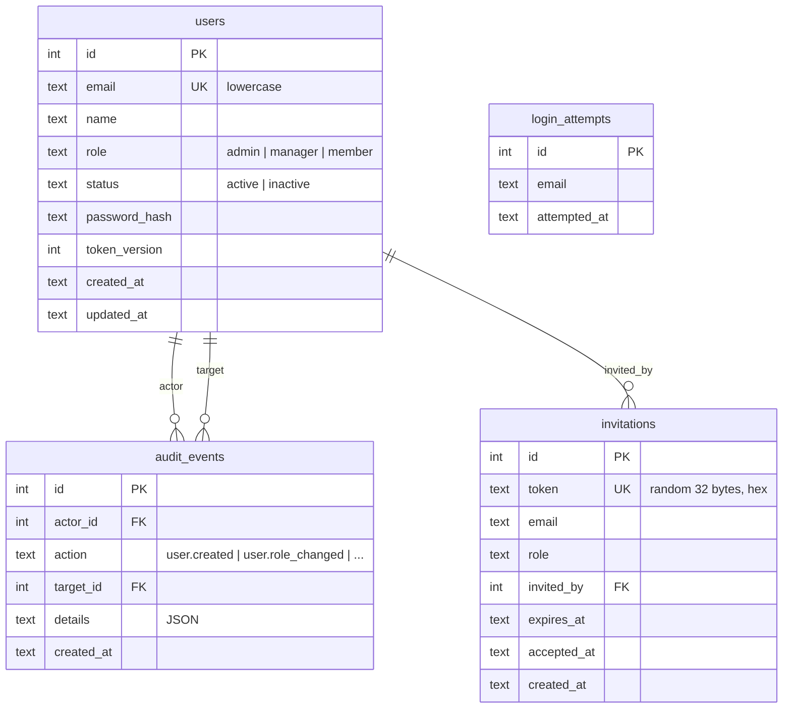

# Data model

```mermaid
erDiagram
  users ||--o{ audit_events : "actor"
  users ||--o{ audit_events : "target"
  users ||--o{ invitations : "invited_by"
  users {
    int id PK
    text email UK "lowercase"
    text name
    text role "admin | manager | member"
    text status "active | inactive"
    text password_hash
    int token_version
    text created_at
    text updated_at
  }
  invitations {
    int id PK
    text token UK "random 32 bytes, hex"
    text email
    text role
    int invited_by FK
    text expires_at
    text accepted_at
    text created_at
  }
  audit_events {
    int id PK
    int actor_id FK
    text action "user.created | user.role_changed | ..."
    int target_id FK
    text details "JSON"
    text created_at
  }
  login_attempts {
    int id PK
    text email
    text attempted_at
  }
```

| Table | Requirements |
|---|---|
| users | REQ-001, REQ-003, REQ-005, REQ-008 |
| invitations | REQ-004 |
| audit_events | REQ-006 (insert only) |
| login_attempts | REQ-002 v2 |
